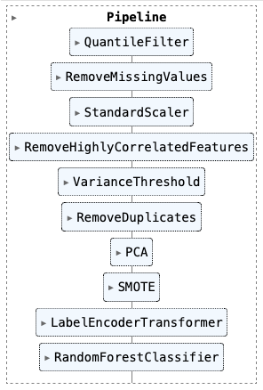

# 🧬 Molecular Classification using Machine Learning

This project focuses on building a complete machine learning pipeline to classify molecular data into binary outcomes (`Positive` / `Negative`).

---

## 🎯 Goal
Develop a robust ML pipeline to classify records as `Positive` or `Negative` based on molecular and biochemical features.

---

## 📊 Dataset
- **Rows**: 7,832 samples  
- **Features**: 103 numerical descriptors of molecular sequences  
- **Target**: `Class` — binary label with values: `Positive` / `Negative`,  
  where `Positive` means the sequence is a B-cell epitope — a part of a protein that can trigger an immune response —
  and `Negative` means it is not.

---

## 🛠️ Techniques used
- Exploratory Data Analysis (EDA)
- Outlier Detection & Handling (Quantile-based Flooring & Capping)
- Feature Selection (Correlation threshold, Variance filtering)
- Dimensionality Reduction (PCA)
- Handling Class Imbalance (SMOTE)
- Model Comparison (RF, SVM, XGBoost, etc.)
- Hyperparameter Tuning (`RandomizedSearchCV`)
- Final pipeline using `sklearn.Pipeline`  

The following diagram illustrates how each preprocessing step is consistently applied to both the training and testing datasets, ensuring no data leakage.  


---

## 🏆 Best Result
| Metric     | Value  |
|------------|--------|
| Model  | Tuned Random Forest |
| AUC        | 0.655 |
| F1 Score   | 0.663 |
| MCC        | 0.213 |

This pipeline reflects the complete sequence of transformations and modeling steps used in the final implementation.  


---

## 📁 Project Structure

```
/molecular_classifier/
├── data/
│   └── df.csv
├── figures/
│   └── *.png
├── notebook/
│   └── molecular_binary_classification.ipynb
├── report/
│   └── molecular_binary_classification.pdf
└── README.md
```

---

## 👤 Author
**Mohammad Sharzehei**  
MSc Data Science – Aston University (Class of 2025)  
Email: sharzehm@gmail.com  
LinkedIn: https://www.linkedin.com/in/msharzehei

---

## 📄 License

This project is intended for educational and portfolio purposes only. It was inspired by the "Understanding Data / Data Mining" module in my MSc program. Please do not reuse the dataset or code for commercial purposes without prior permission.
